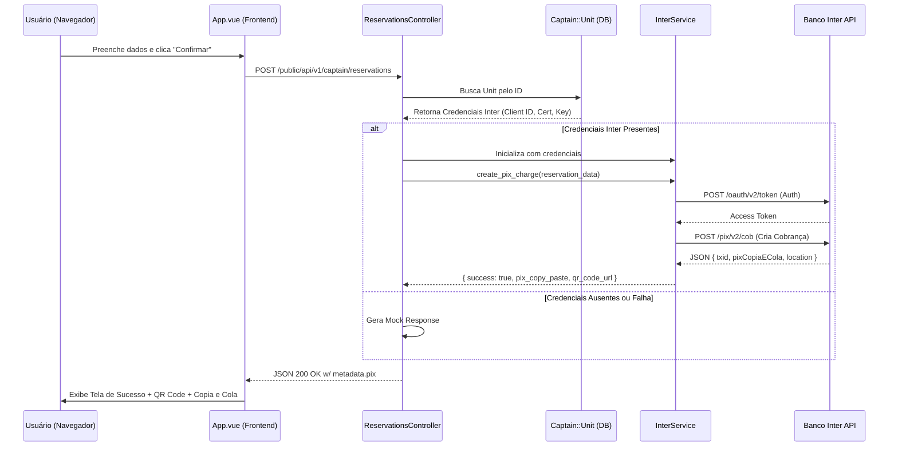

# Fluxo de Geração de PIX - Página Pública de Reservas

Este documento descreve o fluxo técnico de como o PIX é gerado quando um usuário finaliza uma reserva na página pública do Captain Book.

## Visão Geral

O processo envolve a interação entre o Frontend (Vue.js), o Backend (Rails Controller) e a Integração Bancária (Inter Service).

## Detalhes dos Componentes

### 1. Frontend (`App.vue`)

- **Responsabilidade:** Coletar dados do hóspede, calcular preço estimado (baseado nas regras da unidade) e enviar para o backend.
- **Ação:** Ao receber a resposta de sucesso, exibe o modal de "Pagamento Seguro" com o Código "Copia e Cola" e a imagem do QR Code.

### 2. Controlador (`ReservationsController`)

- **Localização:** `enterprise/app/controllers/public/api/v1/captain/reservations_controller.rb`
- **Lógica Principal:**
  1.  Recebe `unit_id` e dados da reserva.
  2.  Verifica se a Unidade (`Captain::Unit`) possui credenciais do Inter configuradas (`inter_client_id`, `inter_client_secret`, etc.).
  3.  Calcula o valor do PIX (atualmente **50% do valor total** como sinal).
  4.  Tenta gerar o PIX real via `InterService`.
  5.  Se falhar ou não tiver config, retorna um **Mock** para não travar o fluxo do usuário.

### 3. Serviço de Integração (`InterService`)

- **Localização:** `app/services/captain/inter_service.rb`
- **Autenticação:** Usa certificado digital (`.crt` e `.key`) e Client Credentials para obter token OAuth.
- **Escopos:** `cob.write cob.read webhook.write webhook.read extrato.read`.
- **Criação de Cobrança:** Envia CPF, Nome e Valor para o endpoint `/pix/v2/cob` do Inter.
- **bypass SSL:** Em ambiente de desenvolvimento, a verificação CRL estrita é ignorada para facilitar testes locais.

## Como o QR Code é Exibido

O Banco Inter retorna uma string `pixCopiaECola` e uma URL `location` (que não é uma imagem direta).
Para exibir o QR Code visualmente na tela, o Frontend utiliza um gerador de QR Code dinâmico (ex: `api.qrserver.com`) passando o valor do `pixCopiaECola` como parâmetro para renderizar a imagem Png.
